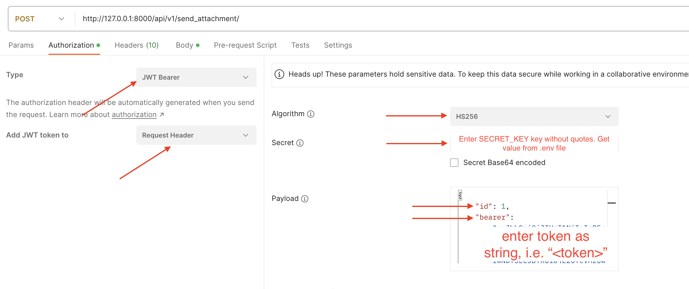
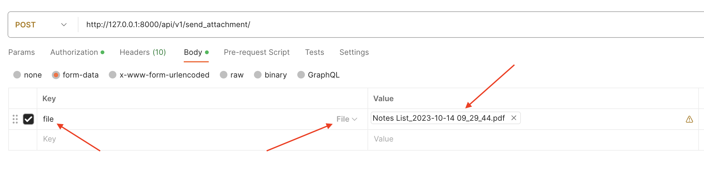

# OnlineNotesAPI

The OnlineNotesAPI is a Django project designed to help users save and organize important notes. It provides a user-friendly and robust API for creating, editing, and managing notes efficiently. It also includes features for user management.

## Features

- **User Authentication:** Secure registration and login system to keep your notes private.

- **Create and Edit Notes:** Easily create new notes and edit existing ones.

- **Categorize Notes:** Organize your notes by assigning them to specific categories.

- **Set Due Dates and Priorities:** Keep track of important dates and prioritize your tasks.

- **Sort and Filter:** Quickly find specific group of notes using sort, categorise or filter options.

- **Export to PDF / CSV:** Save notes list to PDF or CSV, and optionally send via email as an attachment.

### Getting Started

#### Prerequisites

- Python 3.x (Specific version used: 3.11.4)
- MySQL Database
- Django
- Django Rest Framework... **_(see requirements.txt for complete list)_**

#### Installation

- Clone the repository:

  ```
  git clone https://github.com/CDiala/online-notes-api
  cd online-notes-api
  ```

- Create and activate a virtual environment using [this guide](https://docs.python.org/3/library/venv.html) or run

  ```
  python3 -m venv venv
  source venv/bin/activate
  ```

- Install the required packages:

  ```
  pip install -r requirements.txt
  ```

- Install MySQL and create a new MySQL database using [the official guide](https://dev.mysql.com/doc/mysql-getting-started/en/) for your specific OS.

  - NB: For Mac users, in the event of installing mysqlclient via pipenv, if pipfile.lock can’t be locked, run the following commands to fix it (Ref: https://forum.codewithmosh.com/t/pipenv-install-mysqlclient-issues/21727/2):

  ```c
  /bin/bash -c "$(curl -fsSL https://raw.githubusercontent.com/Homebrew/install/HEAD/install.sh)"

  brew install mysql pkg-config

  pipenv install mysqlclient

  ```

- Create an app password [here](https://support.google.com/mail/answer/185833?hl=en). You'll need the password in the next step.

- Add the following to your **Settings** file:

  ```json
  import os
  ...
  DATABASES = {
    'default': {
        'ENGINE': os.environ.get('DB_ENGINE'),
        'NAME': os.environ.get('DB_NAME'),
        'HOST': os.environ.get('DB_HOST'),
        'USER': os.environ.get('DB_USER'),
        'PASSWORD': os.environ.get('DB_PASS'),
    }
  }
  ```

- For debugging, set **`DEBUG`** to **`True`**

- Create a .env file in the root folder, and setup the following variables. Ensure there are no white spaces between keys and values **[e.g. SECRET_KEY=mY-sEcReT_KeY]**, and values shouldn't be quoted.

  ```
  SECRET_KEY
  JWT_SECRET
  DB_ENGINE
  DB_NAME
  DB_HOST
  DB_USER
  DB_PASS
  SMTP_BACKEND
  SMTP_HOST
  SMTP_USER
  SMTP_PASS
  SMTP_PORT
  SMTP_USE_TLS
  ```

  - Hint:

  ```
  DB_ENGINE => Use django.db.backends.mysql as the value in your .env file
  DB_NAME => Your preferred database name
  DB_HOST => Set value in .env file to localhost
  DB_USER => This is your email address where you created the app password
  DB_PASS => This is your app password (without whitespaces)
  ```

- Apply migrations:

  ```
  python3 manage.py makemigrations
  python3 manage.py migrate
  ```

- Create a new superuser

  ```
  python3 manage.py createsuperuser
  ```

- Start the development server:

  ```
  python3 manage.py runserver [port]
  ```

  The app will be accessible at http://127.0.0.1:8000/ or any port specified above

### Usage

#### 1. Authentication:

- The API supports token-based authentication. Obtain a token by sending a POST request to /api/v1/login/ with your username and password. For new users, you will have to first register using /api/v1/register/ before logging in.

#### 2. Endpoints:

##### User Registration

- **Endpoint:** /api/v1/register/
- **Method Allowed:**
  - **POST:** Register new user with first name, last name, email and password.
- **Sample Request:**

  ```http
  POST /api/v1/register/
  Content-Type: application/json
  ```

  ```json
  {
    "first_name": "first_name",
    "last_name": "last_name",
    "email": "new_email",
    "password": "new_password"
  }
  ```

- **Sample Response:**
  ```json
  {
      "user": "first_name last_name",
      "token": <token>
  }
  ```

##### Send Link For Resetting Password To User's Email

- **Endpoint:** `/api/v1/password-reset/`
- **Method Allowed:**
  - **POST:** Send password reset link to provided email
- **Sample Request:**

  ```http
  POST /api/v1/password-reset/
  Content-Type: application/json
  ```

  ```json
  {
    "email": "user_email"
  }
  ```

- **Sample Response:**
  ```
  "A link has been sent to your email to reset your password."
  ```

##### Update User's Password

- **Endpoint:** `/api/v1/password-update/`
- **Method Allowed:**
  - **POST:** Send password update link to provided email
- **Sample Request:**

  ```http
  POST /api/v1/password-update/
  Content-Type: application/json
  ```

  ```json
  {
    "first_name": "first_name",
    "last_name": "last_name",
    "email": "user_email",
    "password": "password"
  }
  ```

- **Sample Response:**
  ```json
  {
    "detail": "Password updated successfully"
  }
  ```

##### User Login

- **Endpoint:** `/api/v1/login/`
- **Method Allowed:**
  - **POST:** Login user with registered email and password
- **Sample Request:**

  ```http
  POST /api/v1/login/
  Content-Type: application/json
  ```

  ```json
  {
    "email": "user_email",
    "password": "user_password"
  }
  ```

- **Sample Response:**
  ```json
  {
    "id": 1,
    "user": "first_name last_name",
    "token": <token>
  }
  ```

##### View User's Details

- **Endpoint:** `/api/v1/me/`
- **Method Allowed:**
  - **GET:** Display logged in user's details
- **Sample Request (Postman):**

  ```
  1. Setup Authorization tab as seen in image below:
  ```

  

  ```
  2. Click send to test the endpoint and observe the response. Ensure to follow the steps in the screenshots as well, and set the method and endpoint accordingly.
  ```

- **Sample Response:**
  ```json
  {
    "id": 1,
    "first_name": "chibuzo",
    "last_name": "diala",
    "email": "dialachibuzo@yahoo.com"
  }
  ```

##### Get List of Notes or Create a New One

- **Endpoint:** `/api/v1/notes/`
- **Method Allowed:**
  - `GET`: Get a list of all ordered items.
  - `POST`: Create a new order item.
- **Sample Request:**

  ```http
  GET /api/v1/notes/
  Authorization: JWT <token> (or Authorization: Bearer <token> )
  ```

  ```http
  POST /api/v1/notes/
  Content-Type: application/json
  Authorization: JWT <token> (or Authorization: Bearer <token> )
  ```

  ```json
  {
    "title": "bye 4 now",
    "slug": "bye-4-now",
    "content": "wfwrrgr",
    "due_date": "2023-10-17",
    "priority": "M",
    "status": "D",
    "category": "O"
  }
  ```

- **Sample Response:**

  - Get

  ```json
  [
    {
      "id": 21,
      "title": "bye 4 now",
      "slug": "bye-4-now",
      "owner": 3,
      "content": "wfwrrgr",
      "created_at": "2023-10-13T21:49:20.469551Z",
      "due_date": "2023-10-17",
      "priority": "M",
      "status": "D",
      "category": "O"
    },
    {
      "id": 11,
      "title": "welcome back",
      "slug": "welcome-back",
      "owner": 3,
      "content": "...",
      "created_at": "2023-10-08T12:20:06.694610Z",
      "due_date": null,
      "priority": "M",
      "status": "N",
      "category": "N"
    }
  ]
  ```

  - Post

  ```json
  {
    "response": "record created successfully.",
    "data": {
      "title": "bye 4 now",
      "slug": "bye-4-now",
      "owner": 3,
      "content": "wfwrrgr",
      "due_date": "2023-10-17",
      "priority": "M",
      "status": "D",
      "category": "O"
    }
  }
  ```

##### Get Details of a Specific Note

- **Endpoint:** `/api/v1/notes/<int:note_id>/`
- **Method Allowed:**
  - `GET`: Get details of a specific note item.
  - `PUT`: Update details of specific note item.
  - `DELETE`: Delete specific note item.
- **Sample Request:**

  ```http
  GET /api/v1/notes/11
  Authorization: JWT <token> (or Authorization: Bearer <token> )
  ```

  ```http
  PUT /api/v1/notes/11
  Content-Type: application/json
  Authorization: JWT <token> (or Authorization: Bearer <token> )

  {
      "title": "welcome back",
      "slug": "welcome-back",
      "owner": 1,
      "content": "CONTENT UPDATED",
      "due_date": "2023-10-22",
      "priority": "L",
      "status": "N",
      "category": "B"
  }
  ```

  ```http
  DELETE /api/v1/notes/11
  Authorization: JWT <token> (or Authorization: Bearer <token> )
  ```

- **Sample Response:**

  - Get

  ```json
  {
    "id": 11,
    "title": "welcome back",
    "slug": "welcome-back",
    "owner": 3,
    "content": "...",
    "created_at": "2023-10-08T12:20:06.694610Z",
    "due_date": null,
    "priority": "M",
    "status": "N",
    "category": "N"
  }
  ```

  - Put

  ```json
  {
    "id": 11,
    "title": "welcome back",
    "slug": "welcome-back",
    "owner": 1,
    "content": "CONTENT UPDATED",
    "created_at": "2023-10-08T12:20:06.694610Z",
    "due_date": "2023-10-22",
    "priority": "L",
    "status": "N",
    "category": "B"
  }
  ```

  - Delete

  ```json
  {
    "response": "deleted"
  }
  ```

##### Validate User's Email Address

- **Endpoint:** `/api/v1/verify-email/`
- **Method Allowed:**
  - **GET:** When a user clicks the email verification link in their email boxes, this endpoint marks their email address as verified in the database.
- **Sample Request:**

  ```
  GET /api/v1/verify-email/?token=<token>
  ```

- **Sample Response:**
  ```json
  {
    "id": 1,
    "user": "first_name last_name",
    "token": <token>
  }
  ```

##### Export to PDF

- **Endpoint:** `/api/v1/pdf_view/`
- **Method Allowed:**
  - **GET:** When a user clicks the email verification link in their email boxes, this endpoint marks their email address as verified in the database.
- **Sample Request:**

  ```http
  GET /api/v1/pdf_view/
  Authorization: JWT <token> (or Authorization: Bearer <token> )
  ```

- **Sample Response:**
  ```
  PDF file is displayed in another browser tab.
  ```

##### Download Notes List to PDF

- **Endpoint:** `/api/v1/pdf_download/`
- **Method Allowed:**
  - **GET:** Download notes list as PDF
- **Sample Request:**

  ```http
  GET /api/v1/pdf_download/
  Authorization: JWT <token> (or Authorization: Bearer <token> )
  ```

- **Sample Response:**
  ```
  PDF file is downloaded to the client's machine.
  ```

##### Download Notes List to CSV

- **Endpoint:** `/api/v1/csv_download/`
- **Method Allowed:**
  - **GET:** Download notes list as CSV
- **Sample Request:**

  ```http
  GET /api/v1/csv_download/
  Authorization: JWT <token> (or Authorization: Bearer <token> )
  ```

- **Sample Response:**
  ```
  CSV file is downloaded to the client's machine.
  ```

##### Send Generated File (CSV, PDF) as Attachment Via Email

- **Endpoint:** `/api/v1/send_attachment/`
- **Method Allowed:**
  - **POST:** Send notes list to user's emailbox as an attachment
- **Sample Request:**

  ```c
  curl -X POST /api/v1/send_attachment/ \
  -H "Content-Type: multipart/form-data; boundary=----WebKitFormBoundary7MA4YWxkTrZu0gW" \
  -H "Authorization: JWT <token> (or Authorization: Bearer <token> )"
  -F "file=@sample.pdf;type=application/pdf"
  ```

- **Testing Via Postman:**

  ```
  1. Setup Authorization tab as seen in image below:
  ```

  

  ```
  2. Setup Body with key "file", type = File and value = <select_a_file_from_your_machine> as seen below:
  ```

  

  ```
  3. Click send to test the endpoint and observe the response. Ensure all steps above are followed to the letter (note the information in the screenshots as well)
  ```

- **Sample Response:**
  ```
  1 mail sent successfully
  ```

##### Logout Current User

- **Endpoint:** `/api/v1/logout/`
- **Method Allowed:**
  - **POST:** logout currently logged in user.
- **Sample Request:**

  ```http
  POST /api/v1/logout/
  ```

- **Testing via In-built Django Rest Framework:**

  ```
  1. Visit the endpoint
  2. Click the POST button
  ```

- **Sample Response:**

  ```json
  {
    "message": "Logout successful"
  }
  ```

### Contributing

If you'd like to contribute to this project, please follow these steps:

- Fork the repository
- Create a new branch (**git checkout -b feature/new-feature**)
- Make your changes and commit them (**git commit -m 'Add new feature'**)
- Push to the branch (**git push origin feature/new-feature**)
- Create a pull request

### License

This project is licensed under the MIT License - see the LICENSE file for details.
